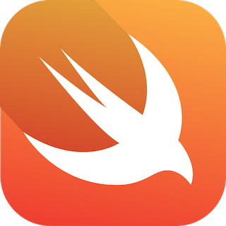

# 🚀 Название вашего проекта

[](https://swift.org)
[](https://developer.apple.com)
[](https://apple.com)

Краткое и емкое описание вашего приложения или библиотеки. Зачем это нужно? Какую проблему решает? (Например: *«Мощный трекер привычек с использованием Swift Data и современных анимаций SwiftUI»*).

---

## 🛠 Технологический стек

- **Язык:** Swift 6 (Strict Concurrency)
- **UI:** SwiftUI / UIKit (выбрать нужное)
- **Архитектура:** MVVM / Composable Architecture (TCA)
- **Бэкенд/Хранение:** Swift Data / Core Data / Firebase
- **Зависимости:** Swift Package Manager (SPM)

## 📋 Требования

- iOS 17.0+ / macOS 14.0+
- Xcode 17.0 (или выше)
- Swift 6.0+

## 🚀 Начало работы

### 1. Клонирование репозитория
```bash
git clone https://github.com
cd название_проекта
